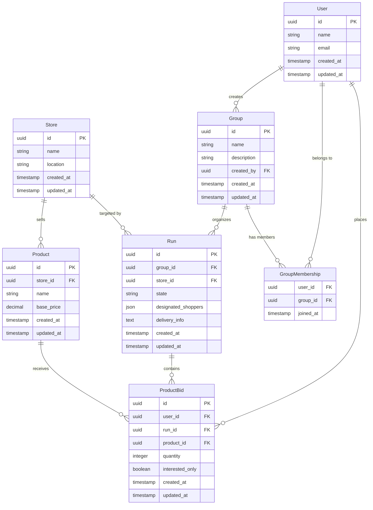

# Database Schema

## Entity Relationship Diagram

## Run States

- `planning` - Initial state, collecting product interest
- `active` - Users placing bids, quantities being tracked
- `confirmed` - Thresholds met, shopping list finalized
- `shopping` - Designated shoppers executing the run
- `completed` - Run finished, costs calculated
- `cancelled` - Run cancelled before completion

## Key Relationships

- **Users ↔ Groups**: Many-to-many via GroupMembership
- **Groups → Runs**: One group can have multiple runs
- **Runs → Store**: Each run targets a specific store
- **Store → Products**: Products belong to specific stores
- **ProductBids**: Junction of User + Run + Product with quantity/interest data