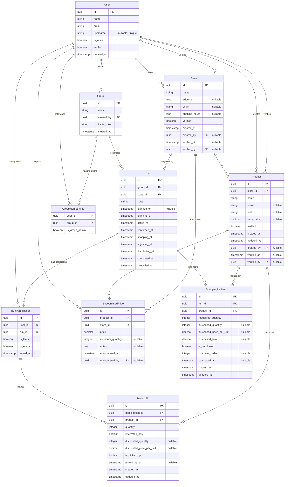

# Database Schema

## Entity Relationship Diagram

## Run States

### State Flow
`planning` → `active` → `confirmed` → `shopping` → `distributing` → `completed`

Can transition to `cancelled` from any state before `distributing`.

### State Definitions

- **`planning`** - Initial state when run is created
  - Only the run leader has placed bids
  - Run leader is the user who created the run
  - Automatically transitions to `active` when any other user places a bid

- **`active`** - Users are actively placing bids
  - Multiple users have placed bids
  - Each user with bids has a "ready" checkbox to indicate their order is complete
  - Automatically transitions to `confirmed` when all users who placed bids mark themselves as ready
  - Run leader can move back to `planning` if needed

- **`confirmed`** - Shopping list is finalized, awaiting shopping trip
  - All users have confirmed their orders
  - Run is ready for shopping but hasn't started yet
  - Run leader can move back to `active` if anyone needs to change their order
  - Run leader manually transitions to `shopping` when heading to the store

- **`shopping`** - Shopping trip is in progress
  - Run leader is at the store executing the shopping list
  - Shopping screen is active for tracking purchases
  - Run leader manually transitions to `distributing` when shopping is complete

- **`distributing`** - Purchased items are being distributed to members
  - Run leader tracks distribution of items to each user
  - Run leader manually transitions to `completed` when all items are distributed

- **`completed`** - Run is finished
  - Final state, serves as historical record
  - All items distributed, run successful

- **`cancelled`** - Run was cancelled before completion
  - Can occur from any state before `distributing`
  - Terminal state

## Key Relationships

- **Users ↔ Groups**: Many-to-many via GroupMembership
- **Groups → Runs**: One group can have multiple runs
- **Runs → Store**: Each run targets a specific store
- **Store → Products**: Products belong to specific stores
- **Users ↔ Runs**: Many-to-many via RunParticipation (tracks leader status and ready state)
- **ProductBids**: Junction of RunParticipation + Product with quantity/interest data
  - Each bid belongs to a participation (which links user + run)
  - Simplifies querying all bids for a user in a run
  - Includes distribution fields: `distributed_quantity`, `distributed_price_per_unit`, `is_picked_up`
- **EncounteredPrices**: Price observations at stores
  - Links Product + Store with price and timestamp
  - Can be reported during shopping runs or standalone
  - Supports minimum quantity requirements for bulk pricing
  - User attribution for community price reporting
- **ShoppingListItems**: Shopping list generation for runs
  - Links Run + Product with requested quantities (sum of all bids)
  - Records actual purchased quantities and prices
  - `purchase_order` tracks the sequence items were purchased
  - No longer stores encountered prices (moved to separate entity)

## Entity Details

### User
- **username**: Nullable, unique identifier that will eventually replace email for login
- **is_admin**: Flag for admin users who can verify stores and products
- **verified**: Whether the user account has been verified
- **created_at**: When the user account was created
- User can create and verify both stores and products (tracked via foreign keys)

### Group
- **invite_token**: Unique token for inviting users to join the group
- **created_at**: When the group was created

### GroupMembership
- **is_group_admin**: Whether the user has admin privileges within this specific group

### Store
- **address**: Physical location of the store (text field)
- **chain**: Chain name (e.g., "Costco", "Sam's Club")
- **opening_hours**: JSON object with operating hours, e.g., `{"monday": "9:00-21:00", ...}`
- **verified**: Whether an admin has verified this store exists (prevents duplicates)
- **created_by**: User who added this store
- **verified_by**: Admin user who verified this store
- **created_at**: When the store was added
- **verified_at**: When the store was verified

### Product
- **brand**: Brand name (nullable)
- **unit**: Unit of measurement (e.g., "kg", "lb", "each", "L")
- **base_price**: Estimated price (now nullable, not mandatory)
- **verified**: Whether an admin has verified this product exists (prevents duplicates)
- **created_by**: User who added this product
- **verified_by**: Admin user who verified this product
- **created_at**: When the product was added
- **updated_at**: Last time the product was modified
- **verified_at**: When the product was verified

### Run
- **planned_on**: The day the leader plans to go shopping (nullable)

State transition timestamps track when the run entered each state:
- **planning_at**: When run was created (always set)
- **active_at**: When run transitioned to active state
- **confirmed_at**: When all users marked themselves ready
- **shopping_at**: When shopping trip began
- **adjusting_at**: When run entered adjusting state (if quantities were insufficient)
- **distributing_at**: When items started being distributed
- **completed_at**: When run was fully completed
- **cancelled_at**: When run was cancelled (if applicable)

### RunParticipation
- **joined_at**: When the user joined this run

### ProductBid
Timestamps for bid tracking:
- **created_at**: When the bid was first placed
- **updated_at**: Last time the bid was modified (quantity or status changed)

Distribution fields for tracking allocation and pickup:
- **distributed_quantity**: Actual quantity allocated to the user (may differ from requested)
- **distributed_price_per_unit**: The actual price paid per unit during shopping
- **is_picked_up**: Whether the user has collected their allocated items
- **picked_up_at**: When the user picked up their items

### EncounteredPrice
A separate entity for tracking price observations at stores:
- **product_id**: Which product this price is for
- **store_id**: Which store this price was found at
- **price**: The price observed
- **minimum_quantity**: Minimum quantity required for this price (e.g., "must buy 2")
- **notes**: Additional context (e.g., "aisle 3", "on sale", "clearance")
- **encountered_at**: When this price was observed (defaults to now)
- **encountered_by**: User who reported this price (nullable for system-generated entries)

This entity is decoupled from runs, allowing price reporting outside of active shopping trips. When viewing prices during a run, the system shows prices from the same day at the same store.

### ShoppingListItem
Manages the shopping process for each product in a run:
- **requested_quantity**: Total quantity needed (sum of all user bids)
- **purchased_quantity**: Actual quantity purchased (may differ from requested)
- **purchased_price_per_unit**: Final price paid per unit
- **purchased_total**: Total cost for this item
- **is_purchased**: Whether the item has been purchased
- **purchase_order**: Order in which items were purchased (for receipt tracking)
- **purchased_at**: When the item was purchased
- **created_at**: When the shopping list item was created
- **updated_at**: Last time the item was modified