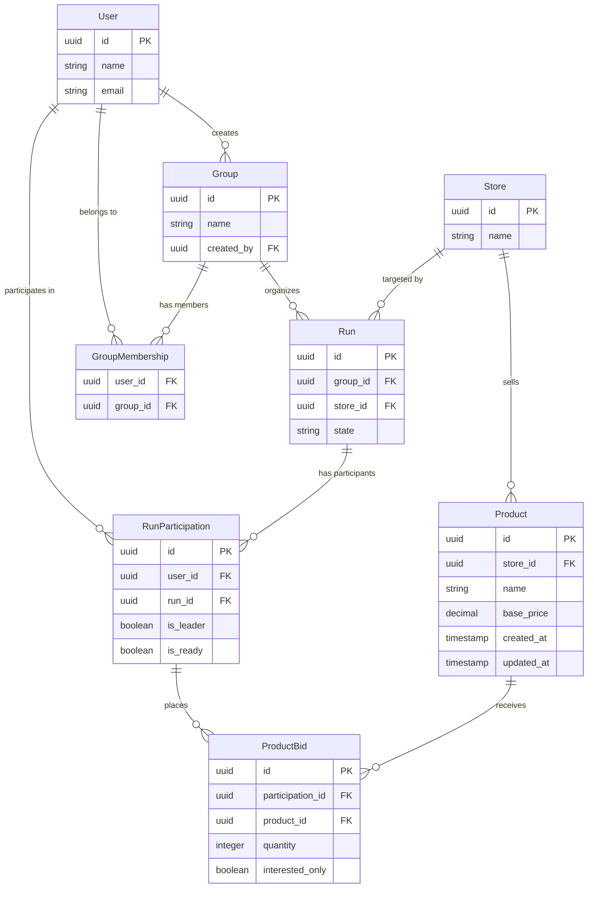

# Database Schema

## Entity Relationship Diagram

## Run States

### State Flow
`planning` → `active` → `confirmed` → `shopping` → `distributing` → `completed`

Can transition to `cancelled` from any state before `distributing`.

### State Definitions

- **`planning`** - Initial state when run is created
  - Only the run leader has placed bids
  - Run leader is the user who created the run
  - Automatically transitions to `active` when any other user places a bid

- **`active`** - Users are actively placing bids
  - Multiple users have placed bids
  - Each user with bids has a "ready" checkbox to indicate their order is complete
  - Automatically transitions to `confirmed` when all users who placed bids mark themselves as ready
  - Run leader can move back to `planning` if needed

- **`confirmed`** - Shopping list is finalized, awaiting shopping trip
  - All users have confirmed their orders
  - Run is ready for shopping but hasn't started yet
  - Run leader can move back to `active` if anyone needs to change their order
  - Run leader manually transitions to `shopping` when heading to the store

- **`shopping`** - Shopping trip is in progress
  - Run leader is at the store executing the shopping list
  - Shopping screen is active for tracking purchases
  - Run leader manually transitions to `distributing` when shopping is complete

- **`distributing`** - Purchased items are being distributed to members
  - Run leader tracks distribution of items to each user
  - Run leader manually transitions to `completed` when all items are distributed

- **`completed`** - Run is finished
  - Final state, serves as historical record
  - All items distributed, run successful

- **`cancelled`** - Run was cancelled before completion
  - Can occur from any state before `distributing`
  - Terminal state

## Key Relationships

- **Users ↔ Groups**: Many-to-many via GroupMembership
- **Groups → Runs**: One group can have multiple runs
- **Runs → Store**: Each run targets a specific store
- **Store → Products**: Products belong to specific stores
- **Users ↔ Runs**: Many-to-many via RunParticipation (tracks leader status and ready state)
- **ProductBids**: Junction of RunParticipation + Product with quantity/interest data
  - Each bid belongs to a participation (which links user + run)
  - Simplifies querying all bids for a user in a run