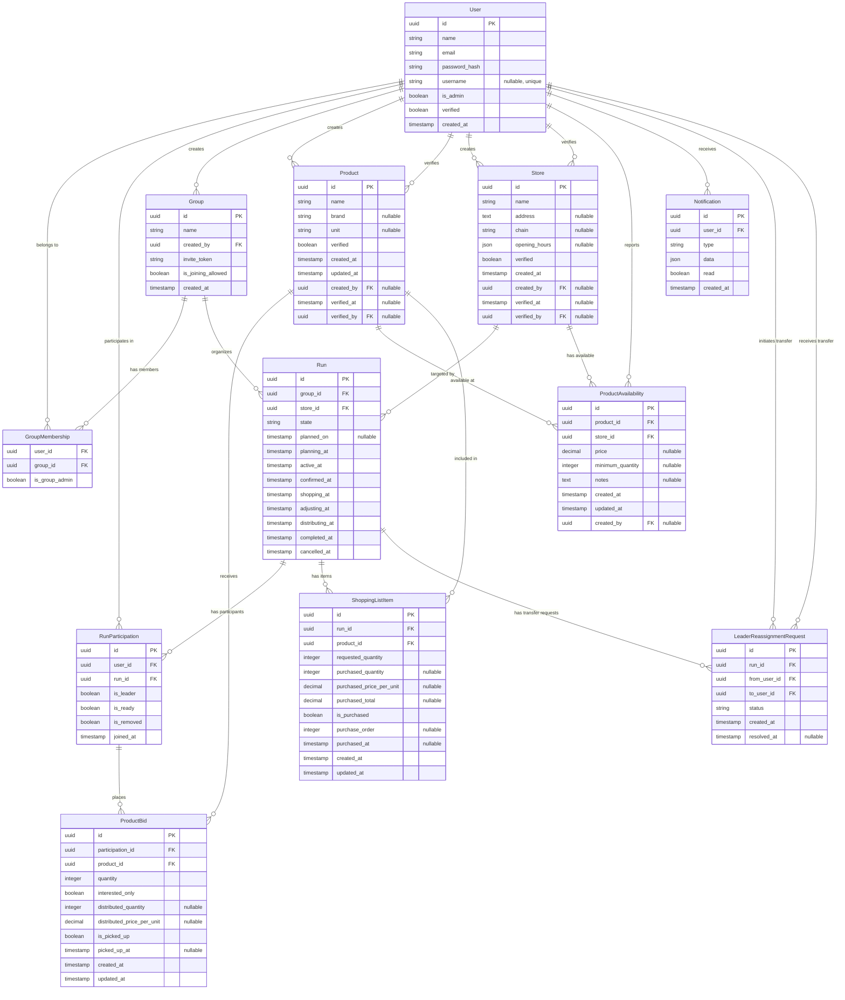

# Database Schema

## Entity Relationship Diagram

## Run States

### State Flow
`planning` → `active` → `confirmed` → `shopping` → `distributing` → `completed`

Can transition to `cancelled` from any state before `distributing`.

### State Definitions

- **`planning`** - Initial state when run is created
  - Only the run leader has placed bids
  - Run leader is the user who created the run
  - Automatically transitions to `active` when any other user places a bid

- **`active`** - Users are actively placing bids
  - Multiple users have placed bids
  - Each user with bids has a "ready" checkbox to indicate their order is complete
  - Automatically transitions to `confirmed` when all users who placed bids mark themselves as ready
  - Run leader can move back to `planning` if needed

- **`confirmed`** - Shopping list is finalized, awaiting shopping trip
  - All users have confirmed their orders
  - Run is ready for shopping but hasn't started yet
  - Run leader can move back to `active` if anyone needs to change their order
  - Run leader manually transitions to `shopping` when heading to the store

- **`shopping`** - Shopping trip is in progress
  - Run leader is at the store executing the shopping list
  - Shopping screen is active for tracking purchases
  - Run leader manually transitions to `distributing` when shopping is complete

- **`distributing`** - Purchased items are being distributed to members
  - Run leader tracks distribution of items to each user
  - Run leader manually transitions to `completed` when all items are distributed

- **`completed`** - Run is finished
  - Final state, serves as historical record
  - All items distributed, run successful

- **`cancelled`** - Run was cancelled before completion
  - Can occur from any state before `distributing`
  - Terminal state

## Key Relationships

- **Users ↔ Groups**: Many-to-many via GroupMembership
- **Groups → Runs**: One group can have multiple runs
- **Runs → Store**: Each run targets a specific store
- **Products ↔ Stores**: Many-to-many via ProductAvailability (products are store-agnostic)
- **Users ↔ Runs**: Many-to-many via RunParticipation (tracks leader status and ready state)
- **ProductBids**: Junction of RunParticipation + Product with quantity/interest data
  - Each bid belongs to a participation (which links user + run)
  - Simplifies querying all bids for a user in a run
  - Includes distribution fields: `distributed_quantity`, `distributed_price_per_unit`, `is_picked_up`
- **ProductAvailability**: Links products to stores with pricing information
  - Confirms a product is available at a specific store
  - Optional price field (user nudged to add, but not required)
  - Can be created/updated during shopping runs or standalone
  - Supports minimum quantity requirements for bulk pricing
  - User attribution for community price reporting
  - Timestamps track when availability was added and last updated
- **ShoppingListItems**: Shopping list generation for runs
  - Links Run + Product with requested quantities (sum of all bids)
  - Records actual purchased quantities and prices
  - `purchase_order` tracks the sequence items were purchased
- **Notifications**: User notifications for run events
  - Each user receives notifications about runs they participate in
  - Flexible JSON data structure for different notification types
  - Tracks read/unread status for UI badge display
- **LeaderReassignmentRequests**: Run leader transfer mechanism
  - Allows current leader to propose transferring leadership to another participant
  - Tracks request status (pending, accepted, declined)
  - Links to run and both users (from and to)

## Entity Details

### User
- **password_hash**: Bcrypt-hashed password for authentication
- **username**: Nullable, unique identifier that will eventually replace email for login
- **is_admin**: Flag for admin users who can verify stores and products
- **verified**: Whether the user account has been verified
- **created_at**: When the user account was created
- User can create and verify both stores and products (tracked via foreign keys)

### Group
- **invite_token**: Unique token for inviting users to join the group
- **is_joining_allowed**: Controls whether new members can join via invite link (allows group closure)
- **created_at**: When the group was created

### GroupMembership
- **is_group_admin**: Whether the user has admin privileges within this specific group

### Store
- **address**: Physical location of the store (text field)
- **chain**: Chain name (e.g., "Costco", "Sam's Club")
- **opening_hours**: JSON object with operating hours, e.g., `{"monday": "9:00-21:00", ...}`
- **verified**: Whether an admin has verified this store exists (prevents duplicates)
- **created_by**: User who added this store
- **verified_by**: Admin user who verified this store
- **created_at**: When the store was added
- **verified_at**: When the store was verified

### Product
Products are now store-agnostic and represent generic items that can be available at multiple stores.

- **name**: Product name (required)
- **brand**: Brand name (nullable)
- **unit**: Unit of measurement (e.g., "kg", "lb", "each", "L") (nullable)
- **verified**: Whether an admin has verified this product exists (prevents duplicates)
- **created_by**: User who added this product (nullable)
- **verified_by**: Admin user who verified this product (nullable)
- **created_at**: When the product was added
- **updated_at**: Last time the product was modified
- **verified_at**: When the product was verified (nullable)

Products link to stores via the `ProductAvailability` entity, allowing the same product to be available at multiple stores with different prices.

### Run
- **planned_on**: The day the leader plans to go shopping (nullable)

State transition timestamps track when the run entered each state:
- **planning_at**: When run was created (always set)
- **active_at**: When run transitioned to active state
- **confirmed_at**: When all users marked themselves ready
- **shopping_at**: When shopping trip began
- **adjusting_at**: When run entered adjusting state (if quantities were insufficient)
- **distributing_at**: When items started being distributed
- **completed_at**: When run was fully completed
- **cancelled_at**: When run was cancelled (if applicable)

### RunParticipation
- **is_removed**: True if user was removed from the group (soft-delete, preserves historical data)
- **joined_at**: When the user joined this run

### ProductBid
Timestamps for bid tracking:
- **created_at**: When the bid was first placed
- **updated_at**: Last time the bid was modified (quantity or status changed)

Distribution fields for tracking allocation and pickup:
- **distributed_quantity**: Actual quantity allocated to the user (may differ from requested)
- **distributed_price_per_unit**: The actual price paid per unit during shopping
- **is_picked_up**: Whether the user has collected their allocated items
- **picked_up_at**: When the user picked up their items

### ProductAvailability
Links products to stores and tracks pricing information:
- **product_id**: Which product is available (FK to Product)
- **store_id**: Which store has this product (FK to Store)
- **price**: The current/last known price (nullable - user is nudged to add but not required)
- **minimum_quantity**: Minimum quantity required for this price (e.g., "must buy 2") (nullable)
- **notes**: Additional context (e.g., "aisle 3", "on sale", "organic section") (nullable)
- **created_at**: When this availability was first recorded
- **updated_at**: Last time the availability or price was updated
- **created_by**: User who added/confirmed this availability (nullable)

This entity serves two purposes:
1. **Availability Confirmation**: Confirms that a product can be found at a specific store
2. **Price Tracking**: Optionally tracks the price of the product at that store

Products are store-agnostic, so a single Product can have multiple ProductAvailability records linking it to different stores. When creating a product, users are prompted to add a store and price, creating both a Product and ProductAvailability in one action.

### ShoppingListItem
Manages the shopping process for each product in a run:
- **requested_quantity**: Total quantity needed (sum of all user bids)
- **purchased_quantity**: Actual quantity purchased (may differ from requested)
- **purchased_price_per_unit**: Final price paid per unit
- **purchased_total**: Total cost for this item
- **is_purchased**: Whether the item has been purchased
- **purchase_order**: Order in which items were purchased (for receipt tracking)
- **purchased_at**: When the item was purchased
- **created_at**: When the shopping list item was created
- **updated_at**: Last time the item was modified

### Notification
Tracks notifications for users about run events and activities:
- **user_id**: Which user receives this notification (FK to User)
- **type**: Notification type identifier (e.g., "run_state_changed", "bid_placed", "user_joined")
- **data**: Flexible JSON payload containing context-specific information such as:
  - `run_id`: The run this notification is about
  - `run_name`: Display name for the run (e.g., "Costco Run")
  - `group_name`: Name of the group
  - `store_name`: Store name for context
  - `old_state`, `new_state`: For state change notifications
  - `user_name`: Name of user who triggered the event
  - Additional fields depending on notification type
- **read**: Whether the user has marked this notification as read (for UI badge display)
- **created_at**: When the notification was created (used for sorting and display)

Notifications are created by the service layer for events such as:
- Run state transitions (planning → active → confirmed, etc.)
- New bids placed or updated
- Users joining or leaving runs
- Leader actions (confirming, starting shopping, etc.)
- Group membership changes

### LeaderReassignmentRequest
Manages the process of transferring run leadership from one user to another:
- **run_id**: Which run this transfer request is for (FK to Run)
- **from_user_id**: Current leader proposing the transfer (FK to User)
- **to_user_id**: User being proposed as new leader (FK to User)
- **status**: Current state of the request:
  - `pending`: Request created, awaiting response from recipient
  - `accepted`: Recipient accepted, leadership transferred
  - `declined`: Recipient declined the transfer
- **created_at**: When the transfer request was created
- **resolved_at**: When the request was accepted or declined (nullable)

This entity supports the leader reassignment feature, allowing run leaders to transfer their responsibilities to another participant. The requesting user must be the current leader, and the target user must be an active participant in the run.